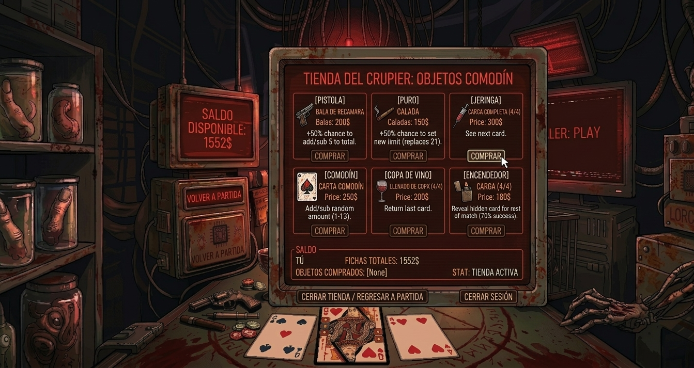

# Diseño del Juego

## Mockups

### Menú


### Juego



### Resultado


## Especificaciones de tecnología
FrameWork elegido: Vue
Elegimos este FrameWork descartando React y Angular ya que existe una leve experiencia en el uso de este, encontrando a este framework mas sencillo y simple para implementar en nuestro proyecto, el React suele ser mas tedioso y mas formal aunque puede lograr el mismo resultado esperado, se inclino por Vue más por un tema de comodidad.
### Estructura de carpetas:
El proyecto tendra varias carpetas que tendran respectivos archivos con sus propias funcionalidades pero que se conectaran entre si para el funcionamiento del juego.
```
ProyectoJuego-LC-AV/
├── index.html
├── package.json
├── pnpm-lock.yaml
├── vite.config.js
├── dockerfile
├── .gitignore
├── .dockerignore
├── .prettierrc
├── eslint.config.js
│
├── .github/
│   └── workflows/
│       └── Main.yml
│
├── Docs/
│   ├── DESIGN.md
│   ├── Planning.md
│   └── Mockups/
│       ├── Menu Inicial.png
│       ├── Durante el juego.png
│       ├── Tienda.png
│       ├── Ganar juego.png
│       └── Perder juego.png
│
├── Test/
│   └── gameStore.test.js
│
└── src/
    ├── App.vue
    ├── main.js
    │
    ├── assets/
    │   ├── Images/
    │   │   ├── bg-menu.png
    │   │   ├── fondo.png
    │   │   ├── btn-nuevo-contrato.png
    │   │   ├── btn-opciones.png
    │   │   ├── btn-reglamentos.png
    │   │   ├── btn-salir.png
    │   │   ├── comodin.png
    │   │   ├── copa.png
    │   │   ├── encendedor.png
    │   │   ├── jeringa.png
    │   │   ├── puro.png
    │   │   └── revolver.png
    │   └── audio/
    │       └── soundtrack.mp3
    │
    ├── components/
    │   ├── Card.vue
    │   ├── GameTable.vue
    │   ├── PlayerUI.vue
    │   ├── ScreenDisplay.vue
    │   ├── ObjetosModal.vue
    │   └── TiendaModal.vue
    │
    ├── views/
    │   ├── MenuView.vue
    │   └── GameView.vue
    │
    ├── store/
    │   └── gameStore.js
    │
    └── router/
        └── index.js
```
### Dependencias
Base del proyecto

Vue 3 — Framework principal
Vite — Entorno de desarrollo y compilación
pnpm — Gestor de paquetes

Dependencias funcionales

Pinia — Manejo del estado global del juego (cartas, turnos, dinero, fase)
Vue Router — Navegación entre vistas (menú principal y mesa de juego)

Dependencias de desarrollo

Vitest — Framework de testing
ESLint — Linter de código
Prettier — Formateo de código
@vue/test-utils — Utilidades de testing para Vue

Nota: Se evaluaron dependencias como GSAP (animaciones) y Howler.js (audio), pero se descartaron por no ser necesarias dado el alcance del proyecto.
### Entorno de Desarrollo
Visual Studio Code

## Descripción del juego
### Nombre: Contrato 21: El pacto de sangre
“Contrato 21: El pacto de sangre”, es un juego de cartas basado en el clásico 21 blackjack, con una estética tenebrosa/industrial, donde te enfrentarás al “Crupier”, una calavera robótica que busca eliminarte, Apuesta fichas para multiplicar tu dinero entre partida para comprar los objetos que te proporciona la mesa para sacar ventaja.

## Mecánica:
```
Blackjack base
Se reparten dos cartas tanto al jugador como al crupier. Una carta de cada uno permanece oculta para el rival. El objetivo es acercarse lo más posible a 21 sin pasarse.
Objetos especiales

Pistola (Estándar) — 50% de sumar o restar 5 puntos al total propio o del crupier. Parte con 1 bala por partida.
Comodín (Estándar) — Suma o resta una cantidad aleatoria entre 1 y 13. Se elige la acción.
Copa de Vino (Estándar) — Devuelve la última carta pedida al mazo.
Jeringa (Premium) — Congela al crupier: no roba carta en su próximo turno.
Encendedor (Premium) — Quema la carta más perjudicial de tu mano.
Puro (Premium) — Revela la carta oculta del crupier.

Los objetos estándar están disponibles desde el inicio. Los objetos premium requieren un desbloqueo único de 1000 $ antes de poder comprarse o usarse. Una vez desbloqueados, se pueden adquirir recargas en la tienda.
Las cargas de objetos se obtienen de dos formas:

Aleatoriamente al final de cada turno (probabilidad variable por objeto)
Comprándolas en la tienda con fichas ganadas en apuestas

Mecánica de apuestas

Jugador y crupier parten con 1000 fichas
Apuesta mínima por turno: 50 fichas
El jugador puede apostar la mínima, subir la apuesta o negarla
Negar la apuesta bloquea el uso de todos los objetos ese turno
El crupier tiene fondos ilimitados
Al inicio de cada nuevo turno de apuestas el jugador recibe +25 fichas
```
### Tienda: 
Puedes comprar y desbloquear cargas de los objetos usando el dinero ganado por medio de las apuestas.

## Flujo de juego:
```
1. Inicio de partida
   └── Se reparten 2 cartas a cada uno (1 oculta, 1 visible)

2. Fase de apuestas
   ├── Apostar (mínimo 50 $)  →  objetos disponibles
   └── Negar apuesta          →  objetos bloqueados ese turno

3. Turno del jugador
   ├── Pedir carta
   ├── Plantarse
   └── Usar objeto (debe ser antes de pedir o plantarse)

4. Turno del crupier (automático)
   ├── Pide carta si su puntaje < 17
   └── Se planta si su puntaje ≥ 17

5. Resolución
   └── El más cercano a 21 sin pasarse gana la ronda
       ├── Ganador se lleva el pozo de apuestas
       └── Se suma 1 victoria al contador del ganador

6. Nueva ronda (repite desde paso 2)
```
### Condición de victoria:
```
Gana la partida completa quien llegue primero a 5 victorias.

Jugador 5 – Crupier 3 → Gana el jugador
Jugador 5 – Crupier 0 → Gana el jugador
Jugador 4 – Crupier 4 → Continúa (nadie llegó a 5)

En caso de empate en una ronda (ambos con el mismo puntaje o ambos pasados de 21 con igual valor), la apuesta se anula y no se suma victoria a ninguno, si ambos jugadores superan el puntaje de 21, se le da la victoria al que este mas cerca del numero anterior mencionado.
Al terminar la partida completa, el marcador, el dinero y los desbloqueos se reinician.
```
